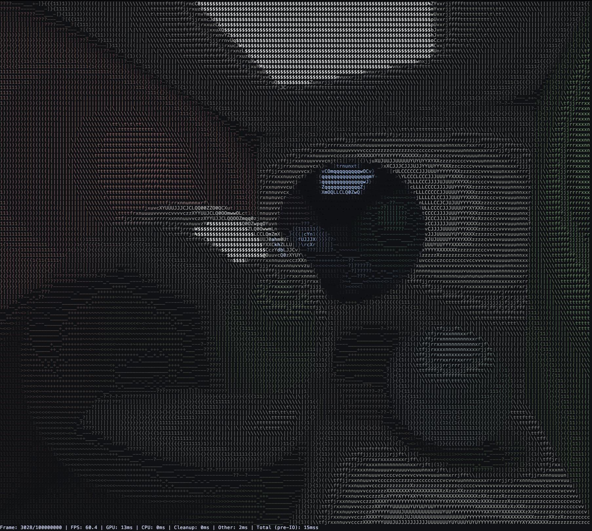
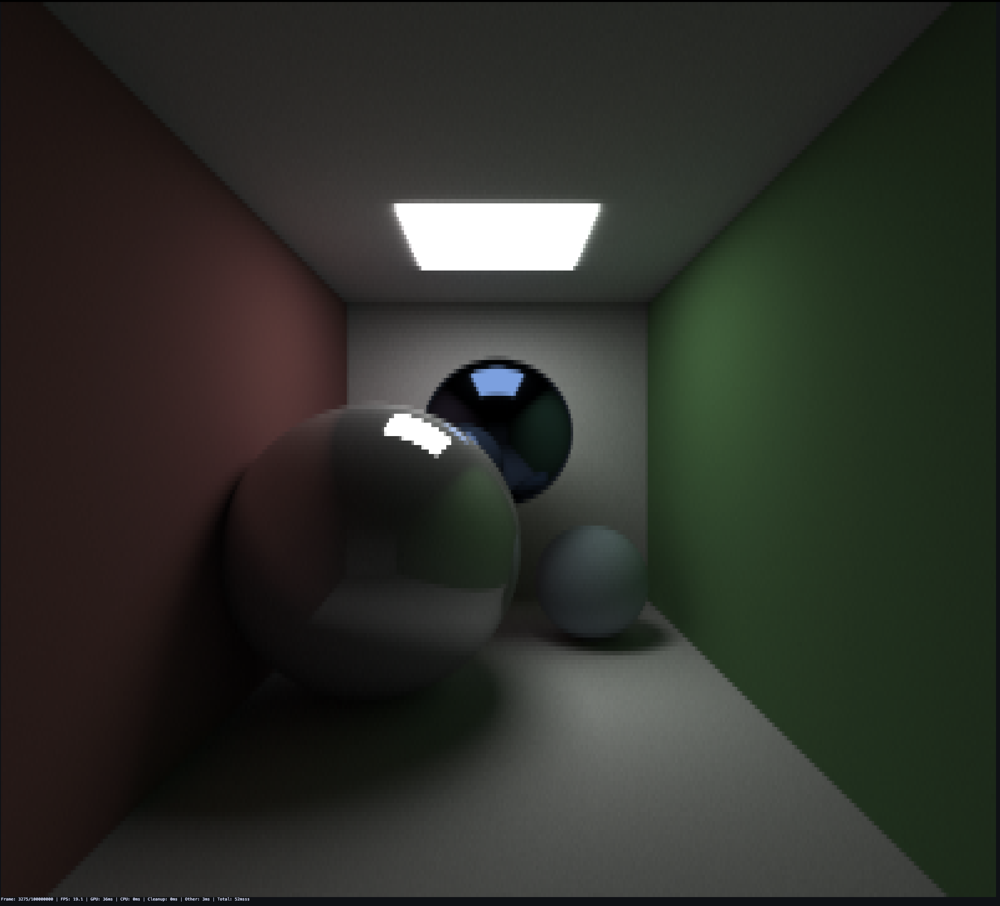
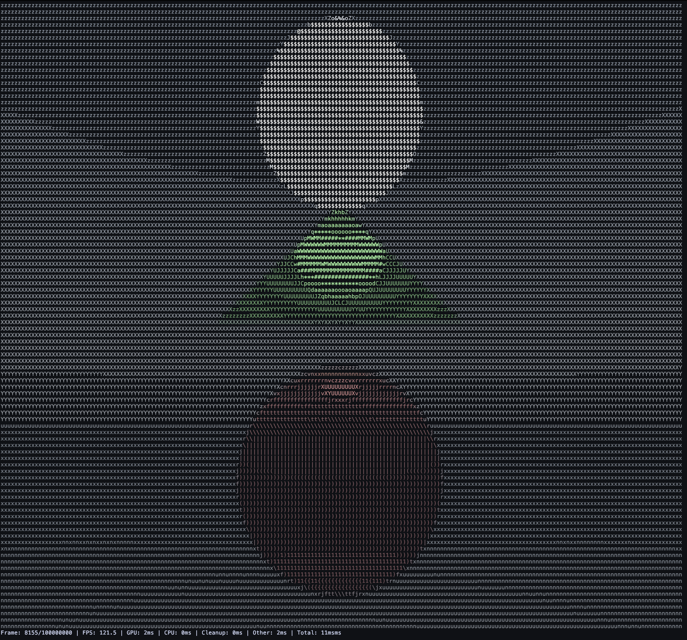

# Terminal Raytracer

A raytracer that renders 3D scenes directly in the terminal using ASCII characters or full-color Unicode blocks "█". Built with Rust and wgpu.

Made for HackClubs Summer Of Hacking

## Features

### Rendering

- **Real-time GPU raytracing** using compute shaders (wgpu)
- **Multiple output modes**: ASCII art or full-color block characters
- **Physically-based rendering** with proper lighting and materials
- **Temporal accumulation** for progressive image refinement
- **Adaptive sampling** for improved quality in complex areas
- **Interactive camera controls** with WASD movement and arrow key rotation

## How to run it yourself

### Prerequisites

- Rust (latest stable) — https://rustup.rs
- A GPU supported by wgpu (Metal on macOS, Vulkan/DirectX on Linux/Windows)
- A modern terminal with truecolor (24-bit) support; disable heavy transparency for best results

### Screenshots





> Note: This project has been developed and tested on macOS (Apple Silicon). It should work on other platforms with a compatible GPU/WGPU backend.

### Build

Clone the repository and build the release binary:

```bash
git clone https://github.com/Gooey321/Terminal-Raytracer.git
cd Terminal-Raytracer
cargo build --release
```

### Run

Usage examples (run from the repo root):

- Run with ASCII output using N threads (defaults to available CPU cores):

```bash
cargo run --release -- --threads 4
```

- Run with full-color block characters (truecolor required):

```bash
cargo run --release -- --full-color --path "src/scenes/Cornell_Box.json"
```

- Enable verbose output for debugging and performance timing:

```bash
cargo run --release -- --verbose --path "src/scenes/Cornell_Box.json"
```

Command-line options supported:

- `--full-color` : render using 24-bit color block characters (`█`) instead of ASCII
- `--threads N` : set rayon thread pool size (defaults to available logical cores)
- `--path <file>`: load a scene JSON file from disk (defaults to `src/scenes/Cornell_Box.json`)
- `--verbose` : print debug / timing information

### Terminal tips

- Use the alternate screen buffer (the program enters it automatically if supported) to avoid scrolling artifacts.
- Pick a dark, near‑black background (e.g. `#0F1115`) rather than pure black to preserve shadow detail.
- Ensure your terminal supports truecolor (24‑bit) for the best full‑color output. Examples: iTerm2, Alacritty, Windows Terminal.
- If output looks slow at large resolutions, reduce terminal size or samples per pixel in the scene JSON.

### Controls

- `W`, `A`, `S`, `D` — move camera (forward/back/left/right)
- Arrow keys — look around (pitch/yaw)
- `ESC` — exit

## Scene Configuration

Scenes are defined in JSON in [`src/scenes/`](src/scenes/). Each scene can contain:

### Basic Settings

```json
{
  "width": 400,
  "height": 200,
  "samples_per_pixel": 16,
  "max_depth": 32,
  "frames_to_accumulate": 100,
  "camera": {
    "fov_degrees": 50.0,
    "char_aspect_ratio": 0.55
  }
}
```

### Objects

```json
{
  "spheres": [
    {
      "center": [0.0, 0.0, -3.0],
      "radius": 0.5,
      "color": [0.8, 0.2, 0.2],
      "emission": [0.0, 0.0, 0.0],
      "reflectivity": 0.3
    }
  ],
  "planes": [
    {
      "point": [0.0, -1.0, 0.0],
      "normal": [0.0, 1.0, 0.0],
      "color": [0.6, 0.6, 0.6],
      "emission": [0.0, 0.0, 0.0],
      "reflectivity": 0.1
    }
  ],
  "triangles": [
    {
      "v0": [-1.0, 1.0, -4.0],
      "v1": [1.0, 1.0, -4.0],
      "v2": [0.0, 2.0, -4.0],
      "color": [0.2, 0.8, 0.2],
      "emission": [0.0, 0.0, 0.0],
      "reflectivity": 0.5
    }
  ]
}
```

### Rendering Techniques

- **Path Tracing**: Physically accurate light transport simulation
- **Next Event Estimation**: Direct light sampling for faster convergence
- **Russian Roulette**: Probabilistic ray termination for efficiency
- **Cosine-weighted Sampling**: Importance sampling for Lambertian surfaces

### Performance Optimizations

- **Adaptive Sampling**: More samples in high-variance areas
- **Temporal Accumulation**: Progressive refinement over multiple frames
- **Efficient Display**: Only renders every 5th frame for interactivity
- **GPU Memory Management**: Optimized buffer usage and staging
